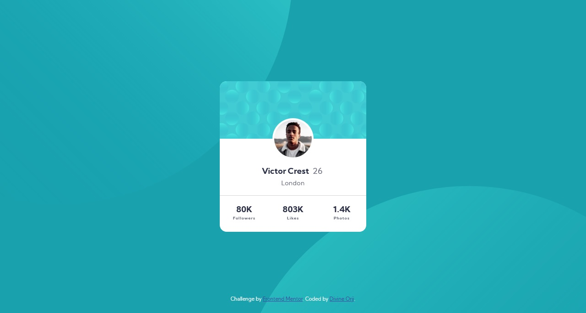

# Frontend Mentor - Profile card component


## Welcome! 👋

Thanks for checking out this front-end coding challenge.

[Frontend Mentor](https://www.frontendmentor.io) challenges help you improve your coding skills by building realistic projects.

**To do this challenge, you need a basic understanding of HTML and CSS.**

## The challenge

Your challenge is to build out this profile card component and get it looking as close to the design as possible.

You can use any tools you like to help you complete the challenge. So if you've got something you'd like to practice, feel free to give it a go.

# Frontend Mentor - Profile card component solution

This is a solution to the [Profile card component challenge on Frontend Mentor](https://www.frontendmentor.io/challenges/profile-card-component-cfArpWshJ). Frontend Mentor challenges help you improve your coding skills by building realistic projects.

## Table of contents

- [Frontend Mentor - Profile card component](#frontend-mentor---profile-card-component)
  - [Welcome! 👋](#welcome-)
  - [The challenge](#the-challenge)
- [Frontend Mentor - Profile card component solution](#frontend-mentor---profile-card-component-solution)
  - [Table of contents](#table-of-contents)
  - [Overview](#overview)
    - [The challenge](#the-challenge-1)
    - [Screenshot](#screenshot)
    - [Links](#links)
  - [My process](#my-process)
    - [Built with](#built-with)
    - [What I learned](#what-i-learned)
    - [Continued development](#continued-development)
    - [Useful resources](#useful-resources)
  - [Author](#author)
  - [Acknowledgments](#acknowledgments)

## Overview

### The challenge

- Build out the project to the designs provided

### Screenshot



### Links

- Solution URL: [Click to view](https://www.frontendmentor.io/solutions/profile-card-component-htmlcss-dhHUINgDB)
- Live Site URL: [Click to view](https://dpkreativ.github.io/profile-card-component/)

## My process

### Built with

- Semantic HTML5 markup
- CSS custom properties
- CSS Grid
- Mobile-first workflow

### What I learned

I learned how to add multiple background-image urls and position them using CSS, and I practiced more on using CSS Grid for layouts. I also improved my knowledge of semantic HTML. The CSS code below shows my implementation of multiple background images.

```css
body {
  background-color: var(--color-1);
  background-image: url(./images/bg-pattern-top.svg),
    url(./images/bg-pattern-bottom.svg);
  background-position: top -45vw left -30vw, bottom -60vw right -20vw;
  background-repeat: no-repeat;
  background-size: 80vw;
}
```

### Continued development

I'm going to keep reading up on semantic HTML so that my understanding of it will improve. I'm also going to build more projects so I can practice the concepts I've learned in both HTML and CSS.

### Useful resources

- [Using Multiple Backgrounds - CSS Tricks](https://css-tricks.com/css-basics-using-multiple-backgrounds/) - This article helped me understand how to use multiple background-image urls in CSS and how to position them.
- [Background Positioning - CSS Tricks](https://css-tricks.com/almanac/properties/b/background-position/) - This article helped me properly understand background positioning.

## Author

- Website - [Divine Orji](https://dpkreativ.vercel.ap)
- Frontend Mentor - [@dpkreativ](https://www.frontendmentor.io/profile/dpkreativ)
- Twitter - [@dpkreativ](https://www.twitter.com/dpkreativ)

## Acknowledgments

Thanks to the authors at CSS Tricks for the indepth explanation of CSS concepts. Those articles are very valuable.
